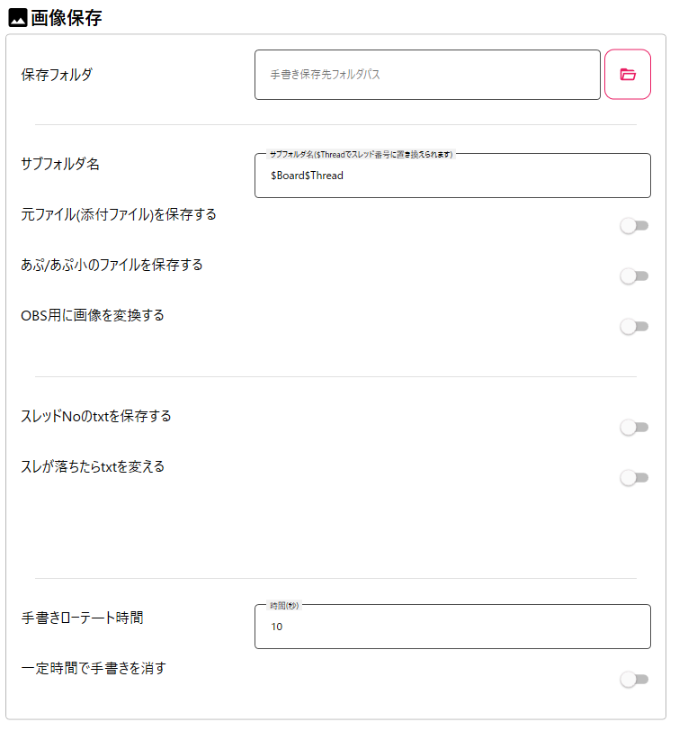
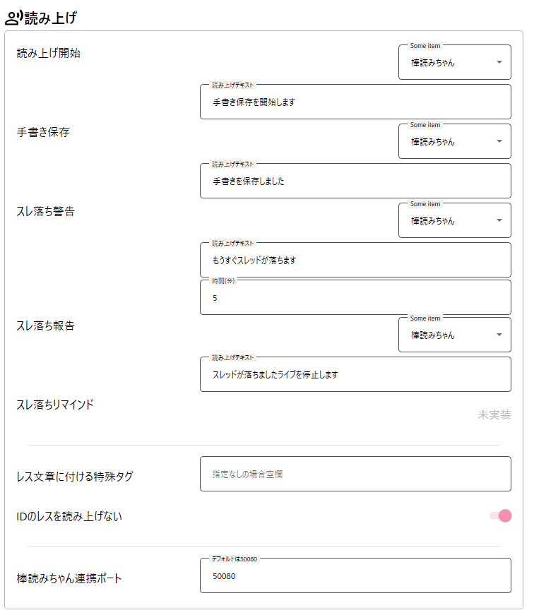
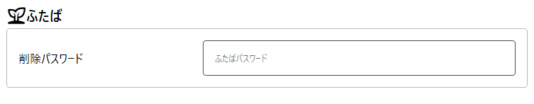
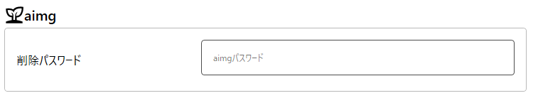
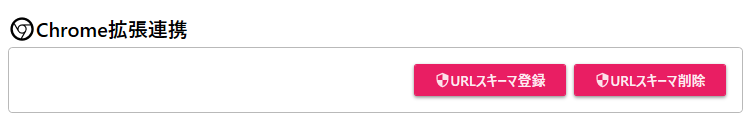
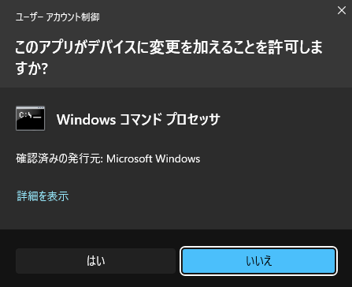
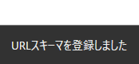
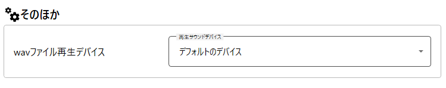
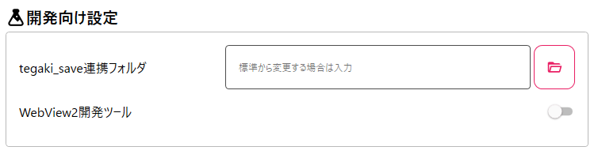

# 設定画面説明
**設定画面は読み上げ前のみ開くことが可能です。**  
読み上げ後に設定を変更したい場合、お手数ですがソフトを立ち上げ直してください。  

## 画像保存
画像保存の各項目について説明します。  

### 保存フォルダ
スレッドの添付ファイルを保存する先を指定します。  

### サブフォルダ名
保存フォルダの先に作成されるサブフォルダ名を指定します。  
基本的に変更不要です。  

### 元ファイル(添付ファイル)を保存する
オンにするとスレッドに添付されたファイルを保存します。  
デフォルトはOFFです。  

### あぷ/あぷ小のファイルを保存する
オンにするとスレッドに書き込まれたあぷ/あぷ小のリンク先のファイルを保存します。  
デフォルトはOFFです。  

### OBS用画像変換
保存された特定のファイルを変換します。  
デフォルトはOFFです。  
変換されるファイル形式と変換先のファイル形式は以下です。  
apng → gif  
webp → png  
awebp → gif  
ファイルは「元ファイル名.conv.拡張子」で出力されます  

### スレッドNoのtxtを保存する
オンにするとスレッドが落ちた時にそのスレッドのNoをtext形式で保存します。  
デフォルトはOFFです。

### スレが落ちたらtxtを変える
オンにするとスレッドが落ちた時にスレッド表示用のtxtファイルの内容を指定した内容に置き換えます。  
デフォルトはOFFです。

### 手書きローテート時間
保存フォルダにあるtegaki.pngを置き換える時間が指定できます。  
連続でお手書きが来た場合は次の画像へ代わる時間になります。
デフォルト10秒です。

### 一定時間で手書きを消す
一定時間後（手書きローテート時間後）tegaki.pngを透過ファイルへ置き換えます。  
デフォルトはOFFです。  

## 読み上げ
読み上げに関する各項目について説明します。  

### 読み上げ開始
スレッドの読み上げ開始時の動作を指定します。  
読み上げ先は 棒読みちゃん / 音声ファイル / OFF が指定できます。  
棒読みちゃんの場合は読み上げる内容（テキスト）を指定します。  
音声ファイルの場合は音声ファイル（wavファイル）を指定します。  
これらの設定は基本的にこの先の手書き保存、スレ落ち警告、スレ落ち報告と共通しています。  

### 手書き保存
スレッドに添付されたファイルを保存するときの動作を指定します。  

### スレ落ち警告
スレッドが落ちる前に警告を読み上げる設定です。  
何分前に警告を発するか指定できます。  
デフォルトは5分です。  

### スレリマインド
本機能は未実装。

### レス文章に付ける特殊タグ  
読み上げのレス行に特殊タグをつけることが出来ます。  
デフォルトは空欄です。  

### IDのレスを読み上げない
スレッドに書き込まれたID付のレスを読み上げません。
デフォルトでONです。

## ふたば
ふたば(img)でのみ使用する項目。  

### 削除パスワード
読み上げたあとに対象のレスを削除する時に使います。   

## aimg
あいもげでのみ使用する項目。  

### 削除パスワード
読み上げたあとに対象のレスを削除する時に使います。   

あいもげのレス削除機能自体は後日実装予定です。

## Chrome拡張連携
Chrome拡張と連携する設定。  

### URLスキーマ登録
スレ詠みちゃんChrome拡張と連携するためのURLスキーマをシステムに登録します。

設定方法について  
※管理者権限が必要です。  
「URLスキーマ登録」をクリックすると「このアプリがデバイスに変更を加えることを許可しますか」と画面に表示されるので  
「はい」をクリックします。

登録が成功すると画面下部に「登録成功」の文字が表示されます。  

### URLスキーマ削除
システムから登録したURLスキーマを削除します。  
登録している場合、スレ詠みちゃんをアンインストールする際、削除をお願いします。  
こちらも登録と同様、管理者権限が必要で削除時にWindowsからの通知が表示されます。  

## そのほか
その他の設定項目。

### wavファイル再生デバイス
読み上げの設定でwavファイルを指定した場合に再生するデバイスを選択できます。  
デフォルトではデフォルトのデバイス（windows側でデフォルトに指定されているデバイス）です。  

## 開発向け設定

### tegaki_save連携フォルダ

この設定はソフトの再起動後に適用されます。(初回設定含む)

### WevView2開発ツール

この設定はソフトの再起動後に適用されます。(初回設定含む)
