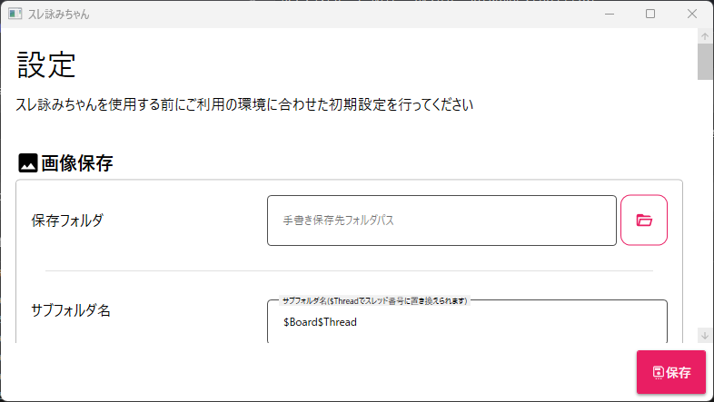
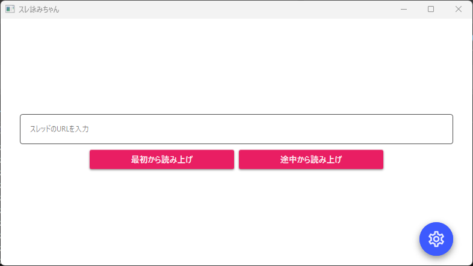
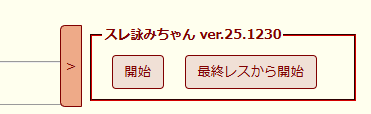
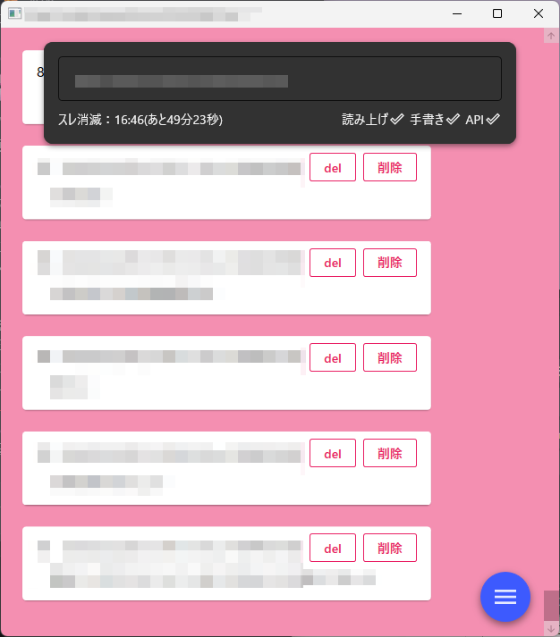
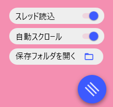
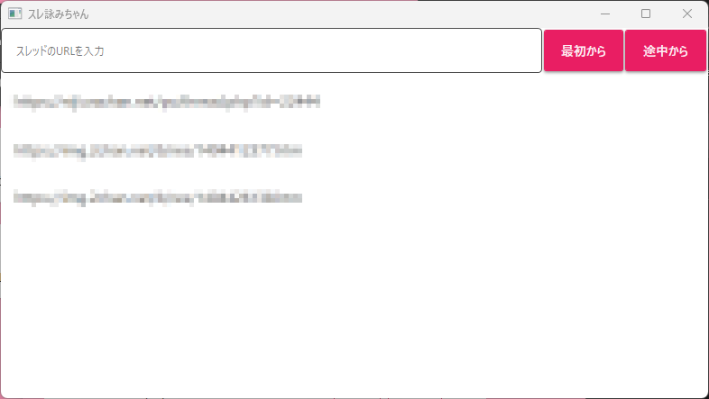

# 使い方

### 初期起動時

初回起動時は以下のように設定画面から始まります。  
左メニュー内の設定画面説明から各種設定をお願いします。  
設定後は保存ボタンをクリックして設定を保存してください。



## URLを指定して読み上げる
画面内の「スレッドのURLを入力」欄にimg/aimgのスレッドURLを入力してください。  
読み上げ開始前なら歯車マーク(⚙)から設定を変更できます。

  

### 最初から読み上げ
スレッドを最初から全てのレスを読み上げ開始します。  

### 途中から読み上げ
スレッドの現在の時点からレス読み上げを開始します。  

読み上げ開始後、保存先に指定したフォルダに以下のような階層でファイルが保存されます。  

```
保存先フォルダ  
├サブフォルダ名  
│└保存した画像  
├tegaki.png   
├threadno.aimg.txt  
└threadno.img.txt  
```

### サブフォルダ名、保存した画像
設定で「元ファイル(添付ファイル)を保存する」または「ぷ/あぷ小のファイルを保存する」の機能をONにした場合、
読み上げしたスレッドに画像が存在すると作成されます。  
画像はサブフォルダ内に保存されます。  

### tegaki.png
読み上げたスレッドで画像が存在したタイミングで画像ががtegaki.pngへ置き換えられます。  
設定の「手書きローテート時間」と「一定時間で手書きを消す」が設定されている場合、  
設定時間経過後、透過画像へ置き換えられます。  

### threadno.aimg.txt 
読み上げているaimgのスレッドNoが書き込まれます。  

### threadno.img.txt 
読み上げているimgのスレッドNoが書き込まれます。

## URLスキーマを利用して読み上げる
設定でURLスキーマを登録している場合に  
img/aimgのスレッドを開いた際、ブラウザの画面右下に読み上げ開始のボタンが表示されます。  
開始ボタンでスレッドの最初からレスを読み上げを開始します。  
最終レスから開始ボタンで最終レスから読み上げを開始します。  
このボタンは＞で閉じることが出来ます。  



## 読み上げ開始後の画面について
読み上げ開始後、スレの内容のウィンドウと現在読み上げをしているウィンドウが表示されます。  

### スレの内容のウィンドウ

  

右下のハンバーガーメニューをクリックると以下のメニューが現れます。  

  

・スレッド読込：スレッドの読み込みのONとOFFが出来ます。デフォルトONです。  
・自動スクロール：新着レスがあると最新レスまで自動スクロールする設定です。デフォルトONです。  
・保存フォルダを開く：クリックすると対象のスレッドの画像保存フォルダを開きます。  

### 現在読み上げをしているウィンドウ

**以下にある現在読み上げをしているウィンドウは最小化されていますので**  
追加で読み上げたいスレッドがある場合は最小化されているウィンドウを開いてURLを入力してください。  
読み上げは複数スレッドに対応しています。  


